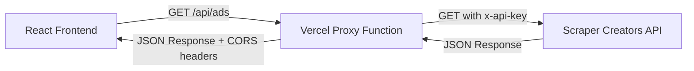

# Design Document: Backend Proxy for CORS Fix

## Overview

This design implements a Vercel Serverless Function that acts as a proxy between the React frontend and the Scraper Creators API. The proxy solves CORS issues by making server-to-server requests, which are not subject to browser CORS policies. The solution maintains the existing data structure and error handling while improving security by keeping the API key on the server side.

The architecture follows a simple request-response pattern:
1. Frontend makes a request to `/api/ads` with query parameters
2. Proxy function validates the request and retrieves the API key
3. Proxy forwards the request to Scraper Creators API
4. Proxy returns the response to the frontend with appropriate CORS headers

## Architecture

### High-Level Architecture



### Component Interaction

The system consists of three main components:

1. **Frontend Client** (`src/lib/scraper-creators.ts`): Initiates requests to the proxy endpoint
2. **Proxy Function** (`/api/ads.ts`): Validates, forwards, and returns responses
3. **External API** (Scraper Creators): Provides the ads data

### Request Flow

```
Frontend Request:
GET https://ads-cw.vercel.app/api/ads?pageId=112150263646404&country=BR&active_status=all&apiKey=xxx

Proxy Processing:
1. Validate request method (GET only)
2. Extract query parameters
3. Retrieve API key (query param or env var)
4. Construct Scraper Creators API URL
5. Forward request with x-api-key header
6. Receive response
7. Add CORS headers
8. Return response to frontend

Frontend Response:
JSON data with same structure as direct API call
```

## Components and Interfaces

### Proxy Function (`/api/ads.ts`)

The serverless function follows Vercel's API route conventions for Node.js runtime.

**File Location:** `/api/ads.ts`

**Function Signature:**
```typescript
export default async function handler(
  request: VercelRequest,
  response: VercelResponse
): Promise<void>
```


**Request Interface:**
```typescript
interface ProxyRequest {
  method: string;
  query: {
    pageId: string;
    country: string;
    active_status: string;
    apiKey?: string;
  };
}
```

**Response Interface:**
```typescript
interface ProxyResponse {
  results?: ScraperCreatorAdRaw[];
  error?: string;
  message?: string;
}
```

**Key Functions:**

1. `validateRequest(request)`: Validates HTTP method and required query parameters
2. `getApiKey(request)`: Retrieves API key from query params or environment variables
3. `forwardRequest(url, apiKey)`: Makes the actual request to Scraper Creators API
4. `setCorsHeaders(response)`: Adds appropriate CORS headers to the response
5. `handleError(response, error)`: Formats and returns error responses

### Frontend Client Updates (`src/lib/scraper-creators.ts`)

**Modified Function:**
```typescript
export const fetchAds = async (): Promise<Ad[]> => {
  const apiKey = localStorage.getItem("scraper_creators_key") || DEFAULT_API_KEY;
  
  const params = new URLSearchParams({
    pageId: PAGE_ID,
    country: "BR",
    active_status: "all"
  });
  
  if (apiKey) {
    params.append("apiKey", apiKey);
  }
  
  const url = `/api/ads?${params.toString()}`;
  
  const response = await fetch(url, {
    method: 'GET',
    headers: {
      'Content-Type': 'application/json'
    }
  });
  
  // Rest of the existing logic remains unchanged
}
```


**Key Changes:**
- URL changed from external API to `/api/ads` (relative path)
- API key passed as query parameter instead of header
- No x-api-key header needed (handled by proxy)
- All other logic (data transformation, error handling) remains identical

## Data Models

### Environment Variables

```typescript
interface EnvironmentVariables {
  SCRAPER_CREATORS_API_KEY?: string;
}
```

**Configuration:**
- Set in Vercel dashboard under Project Settings > Environment Variables
- Available at runtime via `process.env.SCRAPER_CREATORS_API_KEY`
- Optional: allows API key to be passed via query parameter for flexibility

### Query Parameters

```typescript
interface QueryParameters {
  pageId: string;          // Required: Facebook page ID
  country: string;         // Required: Country code (e.g., "BR")
  active_status: string;   // Required: "all", "active", or "inactive"
  apiKey?: string;         // Optional: API key override
}
```

### Error Response Model

```typescript
interface ErrorResponse {
  error: string;           // Error type (e.g., "MISSING_API_KEY")
  message: string;         // Human-readable error message
  status: number;          // HTTP status code
}
```

**Error Types:**
- `MISSING_API_KEY`: No API key provided (401)
- `INVALID_METHOD`: Non-GET request (405)
- `MISSING_PARAMETERS`: Required query params missing (400)
- `UPSTREAM_ERROR`: Scraper Creators API error (502)
- `NETWORK_ERROR`: Connection failure (502)


## Correctness Properties

A property is a characteristic or behavior that should hold true across all valid executions of a system—essentially, a formal statement about what the system should do. Properties serve as the bridge between human-readable specifications and machine-verifiable correctness guarantees.

### Proxy Function Properties

Property 1: Request forwarding with correct headers and parameters
*For any* valid request with pageId, country, and active_status query parameters, the Proxy_Function should forward the request to Scraper_Creators_API with the x-api-key header and all query parameters intact.
**Validates: Requirements 1.2, 1.5, 2.4**

Property 2: Response passthrough without modification
*For any* response from Scraper_Creators_API, the Proxy_Function should return the same JSON structure to the Frontend without modifying the data.
**Validates: Requirements 1.3, 5.1**

Property 3: CORS headers presence
*For any* response from the Proxy_Function, the response should include Access-Control-Allow-Origin, Access-Control-Allow-Methods, and Access-Control-Allow-Headers.
**Validates: Requirements 1.4**

Property 4: API key precedence
*For any* request with an apiKey query parameter, the Proxy_Function should use that key instead of the environment variable when calling Scraper_Creators_API.
**Validates: Requirements 2.2**

Property 5: API key confidentiality
*For any* error response from the Proxy_Function, the response body and message should not contain the API key value.
**Validates: Requirements 2.5**

Property 6: Error status forwarding
*For any* error status code (4xx or 5xx) returned by Scraper_Creators_API, the Proxy_Function should forward the same status code to the Frontend.
**Validates: Requirements 3.1**

Property 7: Method validation
*For any* HTTP request method other than GET, the Proxy_Function should return a 405 status code.
**Validates: Requirements 3.3**

Property 8: Parameter validation
*For any* request missing required query parameters (pageId, country, or active_status), the Proxy_Function should return a 400 status code with details about the missing parameter.
**Validates: Requirements 3.4**

### Frontend Properties

Property 9: Proxy endpoint usage
*For any* call to fetchAds(), the constructed URL should point to `/api/ads` and include pageId, country, and active_status as query parameters.
**Validates: Requirements 4.1, 4.2**

Property 10: Data transformation preservation
*For any* ScraperCreatorAdRaw object received from the proxy, the Frontend should transform it to an Ad object using the same field mappings, carousel logic, and fallback values as the original implementation.
**Validates: Requirements 5.2, 5.3, 5.4, 5.5**

Property 11: Error handling preservation
*For any* error thrown during the fetch operation, the Frontend should handle it the same way as the original implementation (logging and re-throwing).
**Validates: Requirements 4.4**


## Error Handling

### Proxy Function Error Handling

The proxy function implements comprehensive error handling for various failure scenarios:

**1. Missing API Key (401 Unauthorized)**
```typescript
if (!apiKey) {
  return response.status(401).json({
    error: "MISSING_API_KEY",
    message: "API key is required. Provide it via query parameter or environment variable."
  });
}
```

**2. Invalid HTTP Method (405 Method Not Allowed)**
```typescript
if (request.method !== 'GET') {
  return response.status(405).json({
    error: "INVALID_METHOD",
    message: "Only GET requests are allowed."
  });
}
```

**3. Missing Query Parameters (400 Bad Request)**
```typescript
const { pageId, country, active_status } = request.query;
if (!pageId || !country || !active_status) {
  return response.status(400).json({
    error: "MISSING_PARAMETERS",
    message: "Required parameters: pageId, country, active_status"
  });
}
```

**4. Upstream API Errors (502 Bad Gateway)**
```typescript
if (!upstreamResponse.ok) {
  return response.status(502).json({
    error: "UPSTREAM_ERROR",
    message: `Scraper Creators API error: ${upstreamResponse.statusText}`,
    status: upstreamResponse.status
  });
}
```

**5. Network Errors (502 Bad Gateway)**
```typescript
catch (error) {
  console.error("Proxy error:", error.message);
  return response.status(502).json({
    error: "NETWORK_ERROR",
    message: "Failed to connect to Scraper Creators API"
  });
}
```

### Frontend Error Handling

The frontend maintains the existing error handling pattern:

```typescript
try {
  const ads = await fetchAds();
  return ads;
} catch (error) {
  console.error("Failed to fetch ads:", error);
  throw error; // Re-throw for React Query to handle
}
```

React Query configuration handles retries and error states:
- `retry: 1` - Retry failed requests once
- `staleTime: 1000 * 60 * 5` - Cache data for 5 minutes
- Error state exposed via `useAds()` hook for UI error handling

## Testing Strategy

### Dual Testing Approach

This feature requires both unit tests and property-based tests to ensure comprehensive coverage:

**Unit Tests** focus on:
- Specific examples of valid requests and responses
- Edge cases (empty responses, missing fields)
- Error conditions (missing API key, invalid method, network failures)
- Integration points (localStorage access, environment variables)

**Property-Based Tests** focus on:
- Universal properties that hold for all inputs
- Request forwarding correctness across many random inputs
- Data structure preservation across various response shapes
- Error handling consistency across different error types

Together, unit tests catch concrete bugs in specific scenarios, while property tests verify general correctness across a wide range of inputs.

### Property-Based Testing Configuration

**Library Selection:**
- **For TypeScript/Node.js:** Use `fast-check` library
- Installation: `npm install --save-dev fast-check @types/fast-check`

**Test Configuration:**
- Minimum 100 iterations per property test
- Each test must reference its design document property
- Tag format: `// Feature: backend-proxy-cors-fix, Property {number}: {property_text}`

**Example Property Test Structure:**
```typescript
import fc from 'fast-check';

// Feature: backend-proxy-cors-fix, Property 1: Request forwarding with correct headers and parameters
test('proxy forwards requests with correct headers and parameters', () => {
  fc.assert(
    fc.property(
      fc.record({
        pageId: fc.string(),
        country: fc.string(),
        active_status: fc.constantFrom('all', 'active', 'inactive')
      }),
      async (queryParams) => {
        // Test implementation
      }
    ),
    { numRuns: 100 }
  );
});
```

### Test Coverage Requirements

**Proxy Function Tests:**
1. Property test for request forwarding (Property 1)
2. Property test for response passthrough (Property 2)
3. Unit test for CORS headers presence (Property 3)
4. Property test for API key precedence (Property 4)
5. Property test for API key confidentiality (Property 5)
6. Property test for error status forwarding (Property 6)
7. Property test for method validation (Property 7)
8. Property test for parameter validation (Property 8)
9. Unit tests for specific error scenarios (401, 405, 400, 502)
10. Unit test for environment variable access

**Frontend Tests:**
1. Property test for proxy endpoint usage (Property 9)
2. Property test for data transformation preservation (Property 10)
3. Property test for error handling preservation (Property 11)
4. Unit test for localStorage API key inclusion
5. Unit test for React Query configuration
6. Unit test for mock data fallback

### Integration Testing

While not part of the automated test suite, manual integration testing should verify:
- Proxy function deploys correctly to Vercel
- Environment variables are accessible in production
- CORS headers work with the production frontend domain
- End-to-end request flow works in production environment
- Cold start performance is acceptable

### Testing Tools

- **Unit Testing:** Vitest (already configured in the project)
- **Property Testing:** fast-check
- **Mocking:** Vitest's built-in mocking capabilities
- **HTTP Mocking:** Consider `msw` (Mock Service Worker) for mocking external API calls
