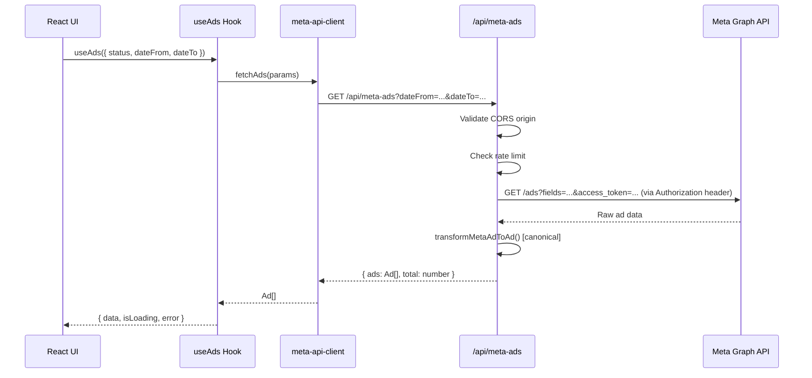

# Design Document — project-improvements-documentation

## Overview

Este documento descreve o design técnico para implementar as 15 melhorias identificadas no projeto **check-in-ads** — um dashboard React + TypeScript que consome a Meta Marketing API via proxy Vercel.

As melhorias estão organizadas em três fases de prioridade:

- **Fase 1 — Crítico**: Segurança da API e integridade de dados (Req. 1–5)
- **Fase 2 — Importante**: Correções de UI/UX e comportamento incorreto (Req. 6–11)
- **Fase 3 — Qualidade**: Robustez, performance e manutenibilidade (Req. 12–15)

### Stack Tecnológica

| Camada | Tecnologia |
|---|---|
| Frontend | React 18, TypeScript, Vite |
| Estilo | TailwindCSS, shadcn/ui |
| Estado assíncrono | React Query v5 |
| Roteamento | React Router v6 |
| Gráficos | Recharts |
| Testes | Vitest + fast-check |
| Deploy | Vercel (Serverless Functions em `/api`) |

---

## Architecture

O sistema segue uma arquitetura de três camadas:

```
┌─────────────────────────────────────────────────────────┐
│                    Browser (React SPA)                   │
│  Pages → Components → Hooks → meta-api-client.ts        │
└──────────────────────┬──────────────────────────────────┘
                       │ HTTP (fetch)
┌──────────────────────▼──────────────────────────────────┐
│              Vercel Serverless Functions                  │
│  /api/meta-ads.ts   /api/health.ts                       │
│  (CORS, Rate Limiting, Token Security)                   │
└──────────────────────┬──────────────────────────────────┘
                       │ HTTPS (Authorization: Bearer)
┌──────────────────────▼──────────────────────────────────┐
│                  Meta Graph API                          │
│  graph.facebook.com/v21.0/{ad_account_id}/ads            │
└─────────────────────────────────────────────────────────┘
```

### Fluxo de dados principal



---

## Components and Interfaces

### Fase 1 — Segurança e Integridade

#### 1.1 CORS Restrito (`api/meta-ads.ts`, `api/health.ts`)

Substituir o wildcard `Access-Control-Allow-Origin: *` por validação de origem baseada em `ALLOWED_ORIGINS`.

```typescript
// Shared CORS utility (api/_cors.ts)
export function applyCors(request: VercelRequest, response: VercelResponse): boolean {
  const allowedOrigins = (process.env.ALLOWED_ORIGINS || '')
    .split(',')
    .map(o => o.trim())
    .filter(Boolean);

  const origin = request.headers['origin'] as string | undefined;

  if (!origin || allowedOrigins.length === 0) {
    response.status(403).json({ error: 'CORS_DENIED', message: 'Origin not allowed.' });
    return false;
  }

  if (allowedOrigins.includes(origin)) {
    response.setHeader('Access-Control-Allow-Origin', origin);
    response.setHeader('Vary', 'Origin');
    response.setHeader('Access-Control-Allow-Methods', 'GET, OPTIONS');
    response.setHeader('Access-Control-Allow-Headers', 'Content-Type');
    return true;
  }

  response.status(403).json({ error: 'CORS_DENIED', message: 'Origin not allowed.' });
  return false;
}
```

#### 1.2 Token Seguro nos Logs (`api/meta-ads.ts`)

O `access_token` deve ser enviado via header `Authorization: Bearer` e nunca aparecer em URLs logadas.

```typescript
// Antes (inseguro):
const url = `${baseUrl}?access_token=${accessToken}&fields=...`;
console.log('Meta API Request URL:', url); // token exposto!

// Depois (seguro):
const url = `${baseUrl}?${params.toString()}`; // sem access_token na URL
const safeUrl = url.replace(/access_token=[^&]+/, 'access_token=REDACTED');
console.log('Meta API Request URL:', safeUrl);

const metaResponse = await fetch(url, {
  headers: { 'Authorization': `Bearer ${accessToken}` }
});
```

#### 1.3 Rate Limiting (`api/meta-ads.ts`)

Implementar rate limiting em memória (adequado para Serverless Functions com instâncias de curta duração):

```typescript
// api/_rate-limit.ts
interface RateLimitEntry {
  count: number;
  windowStart: number;
}

const store = new Map<string, RateLimitEntry>();
const WINDOW_MS = 60_000; // 60 segundos
const MAX_REQUESTS = 30;

export function checkRateLimit(ip: string): { allowed: boolean; remaining: number; retryAfter: number } {
  const now = Date.now();
  const entry = store.get(ip);

  if (!entry || now - entry.windowStart > WINDOW_MS) {
    store.set(ip, { count: 1, windowStart: now });
    return { allowed: true, remaining: MAX_REQUESTS - 1, retryAfter: 0 };
  }

  if (entry.count >= MAX_REQUESTS) {
    const retryAfter = Math.ceil((WINDOW_MS - (now - entry.windowStart)) / 1000);
    return { allowed: false, remaining: 0, retryAfter };
  }

  entry.count++;
  return { allowed: true, remaining: MAX_REQUESTS - entry.count, retryAfter: 0 };
}

export function getClientIp(request: VercelRequest): string {
  const forwarded = request.headers['x-forwarded-for'];
  if (typeof forwarded === 'string') return forwarded.split(',')[0].trim();
  return request.socket?.remoteAddress || 'unknown';
}
```

#### 1.4 Health Check Corrigido (`api/health.ts`)

Usar `app_access_token` (`APP_ID|APP_SECRET`) para validar o token via `debug_token`:

```typescript
// Antes (auto-validação insegura):
const debugTokenUrl = `...debug_token?input_token=${accessToken}&access_token=${accessToken}`;

// Depois (validação correta):
const appSecret = process.env.META_APP_SECRET;
if (!appSecret) {
  return response.status(500).json({ error: 'META_APP_SECRET is required' });
}
const appAccessToken = `${appId}|${appSecret}`;
const debugTokenUrl = `...debug_token?input_token=${accessToken}&access_token=${appAccessToken}`;
```

#### 1.5 Função `transformMetaAdToAd` Canônica

Mover a implementação completa (atualmente em `api/meta-ads.ts`) para `api/_transform.ts` e remover a versão duplicada de `src/lib/meta-api-client.ts`.

```
api/
  _cors.ts          ← novo: utilitário CORS
  _rate-limit.ts    ← novo: rate limiting
  _transform.ts     ← novo: transformMetaAdToAd canônica
  meta-ads.ts       ← modificado: importa de _transform.ts
  health.ts         ← modificado: CORS restrito + app_access_token

src/lib/
  meta-api-client.ts ← modificado: remove transformMetaAdToAd duplicada
```

> **Nota**: As funções em `api/_*.ts` com prefixo `_` não são expostas como endpoints pelo Vercel — apenas arquivos sem prefixo `_` são tratados como rotas.

---

### Fase 2 — UI/UX e Comportamento

#### 2.1 Logger Centralizado (`src/lib/logger.ts`)

```typescript
// src/lib/logger.ts
const isDev = import.meta.env.DEV;

export const logger = {
  debug: (...args: unknown[]) => { if (isDev) console.log(...args); },
  info:  (...args: unknown[]) => { if (isDev) console.log(...args); },
  error: (...args: unknown[]) => console.error(...args), // sempre ativo
};
```

Substituir todos os `console.log` em `Index.tsx`, `use-ads.ts`, `OverviewCards.tsx` e `TopBar.tsx` por `logger.debug/info`. Manter `console.error` para erros reais.

#### 2.2 Settings Refatorada (`src/pages/Settings.tsx`)

Remover o campo "Scraper Creators API Key" sem efeito funcional. Adicionar:
- Seção informativa sobre configuração via variáveis de ambiente Vercel
- Status da integração consumindo `/api/health`

```typescript
// src/pages/Settings.tsx — estrutura nova
const Settings = () => {
  const { data: healthData, isLoading, error } = useQuery({
    queryKey: ['health'],
    queryFn: () => fetch('/api/health').then(r => r.json()),
    retry: 1,
    staleTime: 1000 * 60 * 5,
  });

  return (
    // Card: "Configuração do Token" — explica variáveis de ambiente
    // Card: "Status da Integração" — consome /api/health
    //   - Verde: token válido, dados da conta
    //   - Vermelho: erro com mensagem
  );
};
```

#### 2.3 AnalyticsSection com Dados Reais (`src/components/dashboard/AnalyticsSection.tsx`)

Receber `ads: Ad[]` como prop e calcular os dados dos gráficos dinamicamente:

```typescript
interface AnalyticsSectionProps {
  ads: Ad[];
}

export function AnalyticsSection({ ads }: AnalyticsSectionProps) {
  // Distribuição por status
  const adsByStatus = useMemo(() => [
    { status: 'Active', count: ads.filter(a => a.status === 'active').length },
    { status: 'Inactive', count: ads.filter(a => a.status === 'inactive').length },
  ], [ads]);

  // Série temporal semanal por startDate
  const adActivity = useMemo(() => {
    // Agrupar ads por semana usando startDate
    // Retornar array { date: string, count: number }[]
  }, [ads]);

  if (ads.length === 0) {
    return <EmptyState message="Nenhum dado disponível para o período selecionado." />;
  }

  return (/* gráficos com adsByStatus e adActivity */);
}
```

Atualizar `Index.tsx` para passar `ads` como prop: `<AnalyticsSection ads={ads} />`.

#### 2.4 Timestamp Real no TopBar (`src/components/dashboard/TopBar.tsx`)

Adicionar prop `lastSyncedAt?: Date | null` ao `TopBar` e calcular tempo relativo:

```typescript
interface TopBarProps {
  // ... props existentes
  lastSyncedAt?: Date | null;
}

// Dentro do componente:
const [relativeTime, setRelativeTime] = useState('');

useEffect(() => {
  const update = () => {
    if (!lastSyncedAt) { setRelativeTime('Nunca sincronizado'); return; }
    const diffMs = Date.now() - lastSyncedAt.getTime();
    const diffMin = Math.floor(diffMs / 60_000);
    if (diffMin < 1) setRelativeTime('Sincronizado agora');
    else setRelativeTime(`Sincronizado há ${diffMin} min`);
  };
  update();
  const interval = setInterval(update, 60_000);
  return () => clearInterval(interval);
}, [lastSyncedAt]);
```

O `useAds` hook deve expor `dataUpdatedAt` do React Query para alimentar `lastSyncedAt`.

#### 2.5 Filtro de Período em ActiveAds e InactiveAds

Replicar o padrão de `Index.tsx` (estado `dateRange` + `debouncedDateRange` + `handleDateRangeChange`) nas páginas `ActiveAds.tsx` e `InactiveAds.tsx`, passando `dateFrom`/`dateTo` para `useAds`.

#### 2.6 Persistência de Notas no AdDetailsModal

```typescript
// src/components/dashboard/AdDetailsModal.tsx
const NOTES_KEY = (adId: string) => `ad_notes_${adId}`;

export function AdDetailsModal({ ad, onClose }: AdDetailsModalProps) {
  const [notes, setNotes] = useState(() =>
    ad ? localStorage.getItem(NOTES_KEY(ad.id)) ?? '' : ''
  );
  const hasNotes = notes.trim().length > 0;

  // Persistir ao fechar
  const handleClose = () => {
    if (ad) {
      if (notes.trim()) {
        localStorage.setItem(NOTES_KEY(ad.id), notes);
      } else {
        localStorage.removeItem(NOTES_KEY(ad.id));
      }
    }
    onClose();
  };

  // Indicador visual quando há notas salvas
  // <StickyNote className="h-3 w-3 text-warning" /> no header do modal
}
```

---

### Fase 3 — Qualidade e Robustez

#### 3.1 ErrorBoundary Global (`src/components/ErrorBoundary.tsx`)

```typescript
// src/components/ErrorBoundary.tsx
import { Component, type ReactNode } from 'react';

interface State { hasError: boolean; error: Error | null; }

export class ErrorBoundary extends Component<{ children: ReactNode }, State> {
  state: State = { hasError: false, error: null };

  static getDerivedStateFromError(error: Error): State {
    return { hasError: true, error };
  }

  componentDidCatch(error: Error, info: React.ErrorInfo) {
    console.error('[ErrorBoundary]', error, info.componentStack);
  }

  render() {
    if (this.state.hasError) {
      return (
        <div className="flex flex-col items-center justify-center min-h-screen gap-4">
          <h2>Algo deu errado</h2>
          <p>{this.state.error?.message}</p>
          <button onClick={() => this.setState({ hasError: false, error: null })}>
            Tentar novamente
          </button>
        </div>
      );
    }
    return this.props.children;
  }
}
```

Envolver `<App />` em `src/main.tsx` com `<ErrorBoundary>`.

#### 3.2 QueryClient com Políticas Globais (`src/App.tsx`)

```typescript
const queryClient = new QueryClient({
  defaultOptions: {
    queries: {
      retry: 1,
      refetchOnWindowFocus: false,
      // onError global via queryCache
    },
  },
  queryCache: new QueryCache({
    onError: (error) => {
      toast.error(error instanceof Error ? error.message : 'Erro ao carregar dados');
    },
  }),
});
```

Remover `retry: 0` e `refetchOnWindowFocus: false` locais de `use-ads.ts`.

#### 3.3 Paginação na AdsTable

```typescript
// src/components/dashboard/AdsTable.tsx
const PAGE_SIZE = 50;

interface AdsTableProps {
  ads: Ad[];
  onViewDetails: (ad: Ad) => void;
}

export function AdsTable({ ads, onViewDetails }: AdsTableProps) {
  const [page, setPage] = useState(1);

  // Reset para página 1 quando ads mudam (filtro alterado)
  useEffect(() => { setPage(1); }, [ads]);

  const totalPages = Math.ceil(ads.length / PAGE_SIZE);
  const start = (page - 1) * PAGE_SIZE;
  const pageAds = ads.slice(start, start + PAGE_SIZE);

  return (
    <>
      {/* tabela com pageAds */}
      {/* controles: anterior | página X de Y | próximo */}
      {/* "Exibindo 1–50 de 234 anúncios" */}
    </>
  );
}
```

#### 3.4 Campos de Métricas Obrigatórios (`src/data/mockAds.ts`)

```typescript
export interface Ad {
  // ... campos existentes obrigatórios
  impressions: number;   // era impressions?
  clicks: number;        // era clicks?
  reach: number;         // era reach?
  ctr: number;           // era ctr?
  spend: number;         // era spend?
  leads: number;         // era leads?
  costPerLead: number;   // era costPerLead?
  currency: string;      // era currency?
}
```

O proxy (`api/meta-ads.ts`) já garante valores padrão `0`/`'BRL'` para todos os campos. Os dados mock em `mockAds.ts` precisarão ser atualizados para incluir os campos obrigatórios.

Após a mudança, remover verificações defensivas desnecessárias como `ad.leads || 0` e `ad.impressions !== undefined` em `OverviewCards`, `AdDetailsModal` e `AdsTable`.

---

## Data Models

### Interface `Ad` (após Req. 15)

```typescript
// src/data/mockAds.ts
export interface Ad {
  // Identificação
  id: string;
  adId: string;

  // Criativo
  headline: string;
  body: string;
  ctaText: string;
  destinationUrl: string;
  thumbnail: string;

  // Status e metadados
  status: 'active' | 'inactive';
  platform: string;
  startDate: string;   // ISO 8601
  lastSeen: string;    // ISO 8601
  pageName: string;
  tags: string[];
  notes: string;

  // Métricas de performance (obrigatórias após Req. 15)
  impressions: number;
  clicks: number;
  reach: number;
  ctr: number;         // percentual, ex: 2.45
  spend: number;       // valor monetário
  leads: number;
  costPerLead: number; // valor monetário
  currency: string;    // ex: 'BRL', 'USD'
}
```

### Variáveis de Ambiente (após melhorias)

| Variável | Obrigatória | Descrição |
|---|---|---|
| `META_ACCESS_TOKEN` | Sim | Token de acesso à Meta Graph API |
| `META_AD_ACCOUNT_ID` | Sim | ID da conta de anúncios (ex: `act_123456`) |
| `META_APP_ID` | Sim (Req. 4) | App ID da Meta para validação do token |
| `META_APP_SECRET` | Sim (Req. 4) | App Secret para construir `app_access_token` |
| `META_API_VERSION` | Não | Versão da API (padrão: `v21.0`) |
| `ALLOWED_ORIGINS` | Sim (Req. 1) | Origens permitidas separadas por vírgula |

### Estrutura de Arquivos (após melhorias)

```
api/
  _cors.ts              ← novo
  _rate-limit.ts        ← novo
  _transform.ts         ← novo (função canônica)
  meta-ads.ts           ← modificado
  health.ts             ← modificado

src/
  components/
    ErrorBoundary.tsx   ← novo
    dashboard/
      AdDetailsModal.tsx  ← modificado (persistência de notas)
      AnalyticsSection.tsx ← modificado (dados reais)
      AdsTable.tsx        ← modificado (paginação)
      TopBar.tsx          ← modificado (timestamp real)
  hooks/
    use-ads.ts          ← modificado (remove configs locais)
  lib/
    logger.ts           ← novo
    meta-api-client.ts  ← modificado (remove transformMetaAdToAd)
  pages/
    ActiveAds.tsx       ← modificado (filtro de período)
    InactiveAds.tsx     ← modificado (filtro de período)
    Index.tsx           ← modificado (passa ads para AnalyticsSection)
    Settings.tsx        ← modificado (status real da integração)
  data/
    mockAds.ts          ← modificado (campos obrigatórios)
  main.tsx              ← modificado (ErrorBoundary)
  App.tsx               ← modificado (QueryClient global)
```

---

## Correctness Properties

*A property is a characteristic or behavior that should hold true across all valid executions of a system — essentially, a formal statement about what the system should do. Properties serve as the bridge between human-readable specifications and machine-verifiable correctness guarantees.*

### Property 1: CORS rejeita origens não autorizadas

*Para qualquer* requisição com header `Origin` que não esteja na lista `ALLOWED_ORIGINS`, a função `applyCors` deve retornar `false` e a resposta deve ter status 403.

**Validates: Requirements 1.3, 1.5**

---

### Property 2: CORS aceita origens autorizadas

*Para qualquer* origem que esteja na lista `ALLOWED_ORIGINS`, a função `applyCors` deve retornar `true` e o header `Access-Control-Allow-Origin` da resposta deve ser exatamente igual à origem solicitada.

**Validates: Requirements 1.2**

---

### Property 3: Token nunca aparece em URLs logadas

*Para qualquer* URL construída pelo proxy contendo um `access_token`, a função de sanitização de log deve produzir uma string que não contém o valor original do token.

**Validates: Requirements 2.2, 2.3**

---

### Property 4: Rate limiting bloqueia após limite

*Para qualquer* endereço IP que realize mais de 30 requisições dentro de uma janela de 60 segundos, a função `checkRateLimit` deve retornar `allowed: false` e um `retryAfter` maior que zero a partir da 31ª requisição.

**Validates: Requirements 3.2**

---

### Property 5: Rate limiting permite requisições dentro do limite

*Para qualquer* endereço IP que realize até 30 requisições dentro de uma janela de 60 segundos, a função `checkRateLimit` deve retornar `allowed: true` e `remaining` decrescente a cada chamada.

**Validates: Requirements 3.3**

---

### Property 6: transformMetaAdToAd sempre produz campos obrigatórios

*Para qualquer* objeto de resposta da Meta API (incluindo objetos com campos ausentes, nulos ou malformados), a função `transformMetaAdToAd` deve produzir um objeto `Ad` onde todos os campos de métricas (`impressions`, `clicks`, `reach`, `ctr`, `spend`, `leads`, `costPerLead`, `currency`) são valores não-nulos e do tipo correto.

**Validates: Requirements 5.1, 15.2**

---

### Property 7: Paginação exibe subconjunto correto

*Para qualquer* lista de anúncios e qualquer número de página válido, o subconjunto exibido pela `AdsTable` deve corresponder exatamente ao slice `[(page-1)*50, page*50)` da lista ordenada.

**Validates: Requirements 14.1, 14.3**

---

### Property 8: Paginação reseta ao filtrar

*Para qualquer* estado de paginação em página > 1, quando a lista de anúncios filtrados muda, a página atual deve ser resetada para 1.

**Validates: Requirements 14.4**

---

### Property 9: Notas persistem round-trip no localStorage

*Para qualquer* anúncio com `id` válido e qualquer string de notas não-vazia, salvar as notas ao fechar o modal e reabrir o modal deve recuperar exatamente o mesmo conteúdo de notas.

**Validates: Requirements 11.1, 11.2**

---

### Property 10: Notas vazias são removidas do localStorage

*Para qualquer* anúncio que possua notas salvas, limpar o campo de notas e fechar o modal deve resultar na ausência da chave correspondente no `localStorage`.

**Validates: Requirements 11.3**

---

### Property 11: AnalyticsSection — distribuição por status é consistente

*Para qualquer* lista de anúncios, a soma dos contadores `active` e `inactive` calculados pelo `AnalyticsSection` deve ser igual ao comprimento total da lista de anúncios.

**Validates: Requirements 8.2**

---

### Property 12: logger.debug não emite em produção

*Para qualquer* chamada a `logger.debug` com `import.meta.env.DEV === false`, nenhuma mensagem deve ser emitida para `console.log`.

**Validates: Requirements 6.2**

---

## Error Handling

### Proxy (`api/meta-ads.ts`, `api/health.ts`)

| Condição | Código HTTP | Código de Erro |
|---|---|---|
| Origin não autorizada | 403 | `CORS_DENIED` |
| Rate limit excedido | 429 | `RATE_LIMIT` (+ `Retry-After` header) |
| Variáveis de ambiente ausentes | 500 | `CONFIGURATION_ERROR` |
| `META_APP_SECRET` ausente (health) | 500 | `CONFIGURATION_ERROR` |
| Token inválido/expirado | 401 | `INVALID_TOKEN` |
| Sem permissão na conta | 403 | `PERMISSION_DENIED` |
| Erro genérico da Meta API | 502 | `META_API_ERROR` |
| Timeout de execução | 200 (parcial) | — (retorna ads coletados até o momento) |
| Erro interno | 500 | `INTERNAL_ERROR` |

### Frontend

| Condição | Comportamento |
|---|---|
| Query falha após retry | Toast de erro via `QueryCache.onError` |
| Componente lança erro | ErrorBoundary exibe UI de fallback com botão de retry |
| `/api/health` retorna erro | Settings exibe indicador vermelho com mensagem |
| Lista de ads vazia | AnalyticsSection exibe estado vazio informativo |
| Thumbnail não carrega | `onError` no `` exibe ícone placeholder |

---

## Testing Strategy

### Abordagem Dual

A estratégia combina testes de exemplo (unit tests) para comportamentos específicos e testes baseados em propriedades (property-based tests) para invariantes universais.

**Biblioteca PBT**: `fast-check` (já instalada como devDependency)

**Configuração mínima**: 100 iterações por propriedade (padrão do fast-check)

### Testes de Propriedade (fast-check)

Cada propriedade do documento deve ser implementada como um teste com fast-check. Tag de referência: `Feature: project-improvements-documentation, Property {N}: {texto}`.

| Propriedade | Arquivo de Teste | Tipo |
|---|---|---|
| P1 + P2: CORS | `src/test/api/cors.test.ts` | Property |
| P3: Token sanitization | `src/test/api/token-sanitization.test.ts` | Property |
| P4 + P5: Rate limiting | `src/test/api/rate-limit.test.ts` | Property |
| P6: transformMetaAdToAd | `src/test/api/transform.test.ts` | Property |
| P7 + P8: Paginação | `src/test/components/ads-table-pagination.test.ts` | Property |
| P9 + P10: Notas localStorage | `src/test/components/ad-notes.test.ts` | Property |
| P11: AnalyticsSection distribuição | `src/test/components/analytics-section.test.ts` | Property |
| P12: logger.debug em produção | `src/test/lib/logger.test.ts` | Property |

### Testes de Exemplo (Vitest)

| Cenário | Arquivo de Teste |
|---|---|
| Settings exibe status verde quando health retorna ok | `src/test/components/settings.test.tsx` |
| Settings exibe status vermelho quando health retorna erro | `src/test/components/settings.test.tsx` |
| ErrorBoundary renderiza fallback quando filho lança erro | `src/test/components/error-boundary.test.tsx` |
| ErrorBoundary reseta ao clicar em "Tentar novamente" | `src/test/components/error-boundary.test.tsx` |
| TopBar exibe "Nunca sincronizado" quando lastSyncedAt é null | `src/test/components/topbar.test.tsx` |
| TopBar atualiza texto relativo após 60s | `src/test/components/topbar.test.tsx` |
| Health check retorna 500 quando META_APP_SECRET ausente | `src/test/api/health.test.ts` |

### Testes de Integração

Os seguintes cenários requerem chamadas reais à Meta API e devem ser executados manualmente ou em CI com credenciais configuradas:

- Validação end-to-end do fluxo de busca de anúncios
- Verificação de que o token é transmitido via header `Authorization`
- Confirmação de que o rate limiting funciona em ambiente Vercel

### Cobertura Esperada

- Funções utilitárias puras (`_cors.ts`, `_rate-limit.ts`, `_transform.ts`, `logger.ts`): ≥ 90%
- Componentes React modificados: ≥ 70%
- Páginas: testes de smoke (renderiza sem erros)
